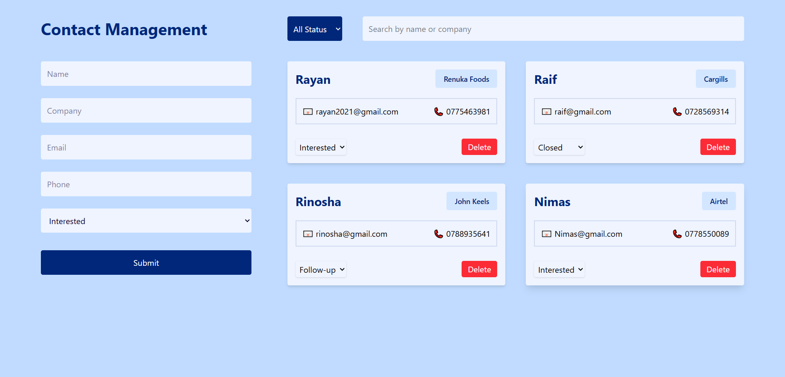

📇 Contact Management System (MERN + Tailwind CSS)

A full-stack Contact Management System built with the MERN stack (MongoDB, Express, React, Node.js) and styled using Tailwind CSS.
This app allows users to add, update, delete, and view contacts, with a clean UI and responsive design.

🚀 Features
🔐 Backend (Node.js + Express + MongoDB)

RESTful API endpoints

Create, Read, Update, Delete (CRUD) operations

MongoDB data persistence using Mongoose

Error handling & validation

Secure environment variable usage

🎨 Frontend (React + Tailwind CSS)

Beautiful and responsive UI

Contact list with search filter

Add / Edit contact forms

Smooth UX with reusable components

Axios-based API calls

(./screenShots/screencapture-01.png)
(./screenShots/screencapture-01.png)
(./screenShots/screencapture-01.png)

📂 Project Structure

/backend
├── models
├── routes
├── server.js
└── .env
/frontend
├── src
│ ├── components
│ ├── assets
│ ├── App.js
│ └── index.js
/screenShots
├── images

⚙️ Installation & Setup
1️⃣ Clone the repository

git clone https://github.com/Kafoor-Nimas/Contact-management-System.git

2️⃣ Install backend dependencies
cd backend
npm install

3️⃣ Install frontend dependencies
cd ../frontend
npm install
/////////////////////////////////////////////
4️⃣ Create .env in /server
MONGO_URI=your_mongodb_connection_string
PORT=5000

▶️ Running the Project
Start backend

cd backend
npm run dev

Start frontend
cd frontend
npm start
////////////////////////////////////////////////
Backend runs on http://localhost:5000
Frontend runs on http://localhost:3000

💡 Future Enhancements

User authentication (JWT)

Profile-based contact storage

Favorite contacts

Pagination & sorting

Dark mode

📜 License

This project is licensed under the MIT License.
